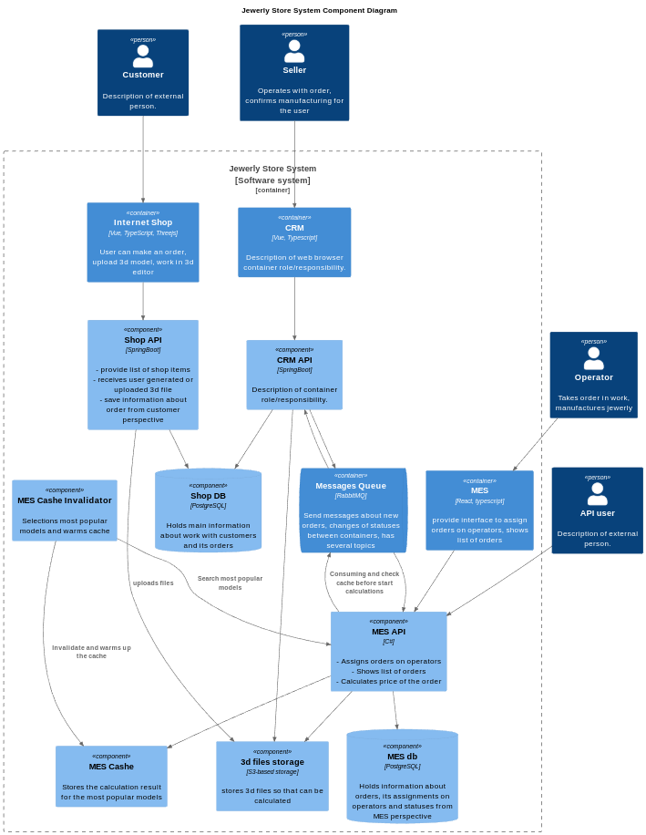

# Задание 1

1. Проанализируйте схему и описание системы. Идентифицируйте существующие и потенциальные проблемные места. Напишите их список.
2. Разработайте инициативы, которые необходимы для устранения нежелательных ситуаций. Запишите их в список.
3. Расставьте инициативы в порядке приоритета. Опишите ход своих рассуждений и ответьте на вопросы:
    - Какой вы видите целевую архитектуру через полгода?
    - Если бы у вас была возможность выполнить только три пункта из списка инициатив в ближайшие полгода, что бы вы выбрали и почему? Необязательно добавлять в список только эпики. Вы можете включить в план как крупные изменения, так и локальные задачи.

## Выработка решения

Следует применить итеративный подход к решению проблемы и сначала взяться за наиболее остые вопросы, которые приводят к снижению прибыли и решить конкретные проблемы бизнеса. Далее постепенно внедрять технологии, которые в последствии помогут справиться с высокими нагрузками.

Поэтому лучшим вариантом, на мой взгляд, будет составление плана разделенного на несколько крупных этапов, где в первую очередь будут внедрятся технологии и практики, которые помогут здесь и сейчас улучшить пользовательский опыт и повысить производительность системы.

Можно выделить несколько основных проблем с которыми сталкивается бизнес:

- Жалобы клиентов на то, что они не получают заказанные изделия в срок. Клиенты API тоже сталкиваются с аналогичной проблемой.
- Замечания операторов из-за подвисания системы с отображением заказов.
- Сложности с деплоем новых версий приложения на прод.

## Предполагаемые решения

- Выделить под расчет моделей машину с самым мощным CPU.
- Отслеживать самые популярные изделия за некий период времени и заранее прогревать кэш.
- Воспользоваться услугами облачной архитектуры и перенести часть расчетов туда.
- Разработать лимиты и тарифы для пользователей API, т.к. они могут недобросовестно его использовать и перегружать нам систему.
- Заранее просчитывать все шаблонные и наиболее популярные модели и помещать результаты рассчета в БД.
- Расчеты стоимости моделей должны запускаться только после проверки кэша и БД на наличия аналогичного рассчета.

## Реализация

- Добавить в систему сервис кэширования
- Добавить сервис инвалидации и прогрева кэша

***Целевая архитетура через полгода***

[<- На главную страницу](../ReadMe.md)
