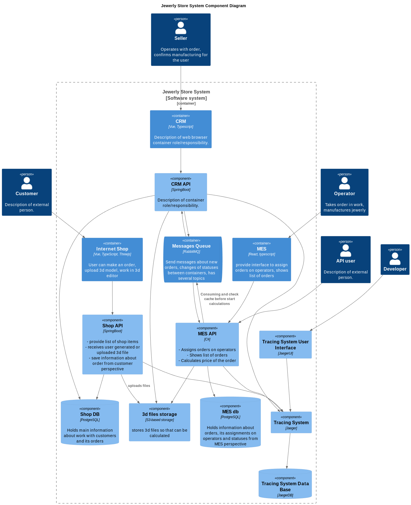

# Задание 3

## Разделы

- [Введение](#введение)
- [Что нужно сделать](#что-нужно-сделать)
- [Анализ системы компании в контексте трейсинга](#анализ-системы-компании-в-контексте-трейсинга)
- [Зачем нужен трейсинг](#зачем-нужен-трейсинг)
- [Выбор подхода к трейсингу](#выбор-подхода-к-трейсингу)
- [Компромиссы](#компромиссы)
- [Анализ ИБ](#анализ-иб)
- [Схема](#схема)

## Введение

Команда видит, что заказы часто находятся в непонятном состоянии или зависают на каком-то сервисе внутри IT-ландшафта. Проблемы с заказами могут появляться и вовсе только потому, что сообщения теряются.

Вам необходимо внедрить инструмент, с помощью которого команда сможет увидеть, что происходило с заказом и где он находится сейчас.

## Что нужно сделать

1. Проанализируйте систему компании и C4-диаграмму в контексте планирования трейсинга. Напишите и выделите на схеме системы, которые следует покрыть трейсингом. Для этого идентифицируйте места, где заказ может «сломаться» или зависнуть.
Составьте список данных, которые должны попадать в трейсинг
2. Добавьте в документ раздел «Мотивация». Напишите здесь, почему в систему нужно добавить трейсинг и что это даст компании. Опишите возможные три-пять технические и бизнес-метрики решения, на которые повлияет внедрение трейсинга.
3. Добавьте раздел «Предлагаемое решение». Опишите, как и с помощью каких технологий будет реализован трейсинг, какие компоненты нужно внедрить или доработать. Отразите компоненты и новые связи на схеме. Скачайте диаграмму контейнеров Александрита» в модели C4. Доработайте диаграмму, исходя из вашего решения: отразите на ней новые компоненты и связи. Новые элементы выделяйте красным цветом — так ревьюеру будет проще проверить вашу работу. Когда схема будет готова, добавьте ссылку на неё в раздел «Предлагаемое решение».
4. Добавьте раздел «Компромиссы». Опишите, в каких случаях трейсинг не принесёт пользы или пока невозможен, или его реализация обойдётся слишком дорого.
Например, сложно заставить проприетарную систему отдавать метрики в нужном формате, может потребоваться дорогостоящая доработка.
5. Проработайте аспекты безопасности. Опишите, какие меры для предотвращения несанкционированного доступа будут предусмотрены для системы трейсинга внутри компании и снаружи если это требуется.
Например: «Внедрение аутентификации — зайти в систему смогут только сотрудники компании с актуальной учетной записью и ролью “Поддержка”».
6. Дополнительное задание. Спроектируйте и опишите в разделе «Предлагаемое решение», как будет реализованы автоматический мониторинг процесса прохождения заказа, полученные из данных трейсинга, и алертинг. Обновите последний вариант диаграммы, который вы подготовили для этого раздела, — отразите на нём необходимые связи. Новые элементы выделяйте зелёным цветом. Добавьте отдельную ссылку на новый вариант диаграммы.

## Анализ системы компании в контексте трейсинга

В текущей архитектуре отсутствие системы трассировки существенно затрудняет диагностику ошибок и выявление причин задержек в работе приложений в производственной среде. Сложности возникают при:

- Локализации причин ошибок, возникающих в бизнес-процессах.
- Анализе производительности и выявлении “узких мест” в работе системы.
- Оптимизации времени обработки запросов.
Внедрение системы трассировки (Tracing) позволит:
- Отслеживать полный путь запроса от клиента до получения ответа, включая взаимодействие между компонентами системы.
- Выявлять текущие и потенциальные проблемы в работе системы, связанные с производительностью, функциональностью и интеграцией между сервисами.
- Сократить время, необходимое для устранения неисправностей и повышения качества обслуживания пользователей.

## Зачем нужен трейсинг

В текущей архитектуре отсутствие системы трассировки (Tracing) существенно затрудняет диагностику ошибок и выявление причин задержек в работе приложений в производственной среде. Сложности возникают при:

- Локализации причин ошибок, возникающих в бизнес-процессах.
- Анализе производительности и выявлении “узких мест” в работе системы.
- Оптимизации времени обработки запросов.
Внедрение системы трассировки (Tracing) позволит:
- Отслеживать полный путь запроса от клиента до получения ответа, включая взаимодействие между компонентами системы.
- Выявлять текущие и потенциальные проблемы в работе системы, связанные с производительностью, функциональностью и интеграцией между сервисами.
- Сократить время, необходимое для устранения неисправностей и повышения качества обслуживания пользователей.

## Выбор подхода к трейсингу

Для обеспечения эффективной трассировки, необходимо собирать следующие данные:

- `Trace ID` - Глобальный идентификатор, присваиваемый каждому запросу.
- `Идентификатор этапа (Span ID)` - Идентификатор для каждого этапа обработки запроса, например, отправка/чтение сообщений из RabbitMQ, запросы к базе данных.
- `Теги` - Дополнительные атрибуты, расширяющие контекст запроса:
  - order_id: Идентификатор заказа.
  - user_type: Тип пользователя (B2C или B2B).
  - service_name: Имя сервиса (Shop API, CRM API, MES API).
  - queue_name: Имя очереди (для RabbitMQ).
  - error_code или exception_type: Код ошибки или тип исключения (при возникновении ошибок).

## Компромиссы

Внедрение системы трассировки предполагает:

- `Дополнительные затраты ресурсов и сложности` - Требуется настройка приложений (фронтенд и бэкенд) для передачи данных трассировки.
- `Необходимость маскирования данных` - Реализация механизмов маскирования конфиденциальных данных в рамках логирования и трассировки.

## Анализ ИБ

Для обеспечения безопасности данных необходимо:

- `Контроль доступа` - Реализовать систему аутентификации и авторизации для доступа к данным трассировки, обеспечив доступ только авторизованным пользователям (разработчикам и бизнес-администраторам).
- `Маскирование данных` - Настроить систему трассировки для исключения попадания конфиденциальных и персональных данных в логи и трассировки.
- `Защита доступа` - Ограничить доступ к системе трассировки только из внутреннего контура системы, используя, например, VPN для доступа.

## Схема

[<- На главную страницу](../ReadMe.md)
