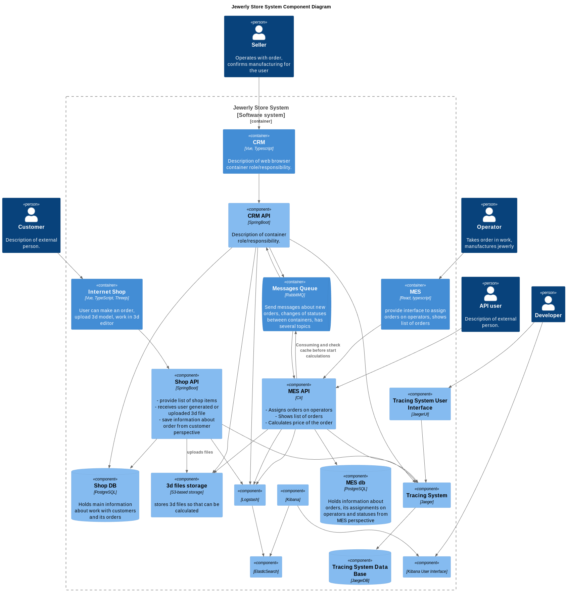

# Задание 4

## Разделы

- [Введение](#введение)
- [Что нужно сделать](#что-нужно-сделать)
- [Анализ системы компании в контексте логирования](#анализ-системы-компании-в-контексте-логирования)
- [Зачем нужно логирование](#зачем-нужно-логирование)
- [Выбор стратегии логирования](#выбор-стратегии-логирования)
- [Анализ логов](#анализ-логов)
- [Схема](#схема)

## Введение

Сейчас ошибки или нестандартные ситуации разбираются со слов клиента: клиенты рассказывают, как что-то пошло не так. Чтобы понять, что случилось, разработчикам и специалистам поддержки требуется очень много времени.

Нужно найти системное решение, которое упростит разбор проблем внутри сервисов и снизит нагрузку поддержки.

## Что нужно сделать

1. Проанализируйте систему компании и C4-диаграмму в контексте планирования логирования. Опишите, какие логи нужно собирать и отметьте на схеме, из каких систем требуется сбор логов. Составьте список необходимых логов с уровнем INFO.
Например, изменение статуса заказа. Логируем время, идентификатор покупателя, номер заказа.
Напишите, будете ли вы использовать другие уровни логирования и при каких обстоятельствах
2. Добавьте в файл раздел «Мотивация». Напишите здесь, почему в систему нужно добавить логирование и что это даст компании. Опишите три-пять технические и бизнес-метрики решения, на которые может повлиять внедрение логирования.
Команда не сможет реализовать единовременно логирование и трейсинг всех выделенных для этого систем. Поэтому опишите, для каких систем нужно настраивать логирование и трейсинг в первую очередь и почему.
3. Добавьте раздел «Предлагаемое решение».
Опишите, как и с помощью каких технологий будет реализовано логирование, какие компоненты нужно внедрить или доработать. Отразите компоненты и новые связи на схеме.
Проработайте политику безопасности в отношении логов — как будет происходить работа с чувствительными данными, кто будет иметь доступ к логам.
Проработайте политику хранения в отношении логов — будет ли это отдельный индекс под систему, сколько они будут храниться и какого размера будут.
4. Проработайте необходимые мероприятия для превращения системы сбора логов в систему анализа логов:
Нужно ли настроить какой-то алертинг?
Нужно ли искать аномалии? Например, было четыре записи о создании заказов и за секунду их стало 10 000. Возможно, происходит DDoS-атака конкурентами.
5. Дополнительное задание. Проработайте критерии для выбора технологии для работы с логами и обоснуйте свой выбор через плюсы и минусы. Выделите не менее пяти критериев.

## Анализ системы компании в контексте логирования

Всего есть 6 уровней логирования TRACE, DEBUG, INFO, WARN, ERROR и FATAL.

- `TRACE, DEBUG` Наиболее детализированные уровни, предназначенные для отладки приложений и анализа хода выполнения операций
- `INFO` Информационные сообщения об успешном выполнении операций (например, вход пользователя в систему, загрузка файла, изменение статуса заказа, успешная оплата).
- `WARN` Предупреждения о потенциальных проблемах, которые пока не являются критичными (например, неудачная попытка входа в систему).
- `ERROR` Сообщения о серьезных ошибках, приводящих к частичной или полной неработоспособности сервисов (например, ошибки базы данных, ошибки внешних API, ошибки в логике сервиса).
- `FATAL` Сообщения о критических ошибках, приводящих к полной неработоспособности приложения 
(например, OOM Error - нехватка памяти).

## Зачем нужно логирование

ффективное логирование является критически важным элементом для мониторинга, диагностики и анализа работы 
информационных систем. Централизованная система логирования позволит:

- Оперативно отслеживать состояние приложений и выявлять возникающие проблемы.
- Проводить детальное расследование инцидентов и определять причины сбоев.
- Настраивать систему оповещений (алертинг) для быстрого реагирования на критические ошибки.
- Оптимизировать производительность системы путем анализа логов.

Внедрение централизованной системы логирования позволит повысить стабильность, надежность и безопасность ИТ-инфраструктуры.

Внедрение системы логирования окажет положительное влияние на следующие бизнес-показатели:

- `Количество ошибок` Снижение количества ошибок за счет оперативного выявления и устранения проблем.
- `Скорость выявления и исправления ошибок (SLA)` Сокращение времени, необходимого для выявления и исправления ошибок.
- `Удовлетворенность клиентов` Повышение удовлетворенности клиентов за счет стабильной работы сервисов.
- `Процент потерянных заказов` Снижение процента потерянных заказов за счет оперативного устранения ошибок.
- `Нетипичное поведение системы (безопасность)` Выявление нетипичного поведения системы, указывающего на возможные угрозы безопасности.
- `Расчет скорости исполнения кода в приложении` Анализ времени выполнения кода для выявления “узких мест” и оптимизации производительности.

Учитывая текущую архитектуру и нагрузку на сервисы, логирование будет внедряться поэтапно. В первую очередь необходимо настроить логирование в сервисе MES, т.к. это самый нагруженный сервис в системе, где ошибки могут привести к значительным финансовым потерям и срыву производственных планов. Далее следует настроить логирование в CRM системе т.к. с ней активно работают менеджеры и логирование поможет им оперативно реагировать на проблемы в работе системы, а также логирование потребуется для аудита действий пользователей в CRM. Остальные части системы, также в порядке приоритета, учитывая их критичность и влияние на бизнес-процессы.

## Выбор стратегии логирования

Для реализации централизованной системы логирования рекомендуется использовать ELK Stack (Elasticsearch, Logstash, Kibana):

- `Logstash` - Компонент для сбора, обработки и передачи логов с серверов и контейнеров.
- `Elasticsearch` - Централизованное хранилище логов.
- `Kibana` - Пользовательский интерфейс для поиска, анализа и визуализации логов.

Политика хранения логов и безопасности:

- `Маскирование конфиденциальных данных` - Необходимо реализовать маскирование конфиденциальных и персональных данных в логах для соблюдения требований безопасности и защиты персональных данных.
- `Длительное хранение логов аудита` - Логи аудита (например, записи о входе пользователей в систему, оплате заказов)
Примерный срок хранения пол года - год.
- `Контроль доступа к логам` - Доступ к логам должен быть ограничен только зарегистрированными разработчиками и администраторами системы.

Для эффективной организации и поиска логов стоит использовать отдельные индексы для каждой системы:

- `mes-logs-%{YYYY.MM.dd}`
- `crm-logs-%{YYYY.MM.dd}`
- `shop-logs-%{YYYY.MM.dd}`
- `rabbitmq-logs-%{YYYY.MM.dd}`
- `audit-logs-%{YYYY.MM.dd}` - аудит логи с расширенным сроком хранения

Для автоматического удаления устаревших данных рекомендуется использовать Index Lifecycle Management (ILM) в Elasticsearch.

## Анализ логов

Необходимо настроить систему оповещений (алертинг) с использованием Kibana Alerting для оперативного реагирования на следующие события:

- Фатальные ошибки (FATAL).
- Ошибки (ERROR).
- Частые падения/перезапуски сервисов.
- Частые неудачные попытки входа в систему.
- Резкое повышение количества запросов/загруженности сервисов.

## Схема

[<- На главную страницу](../ReadMe.md)
