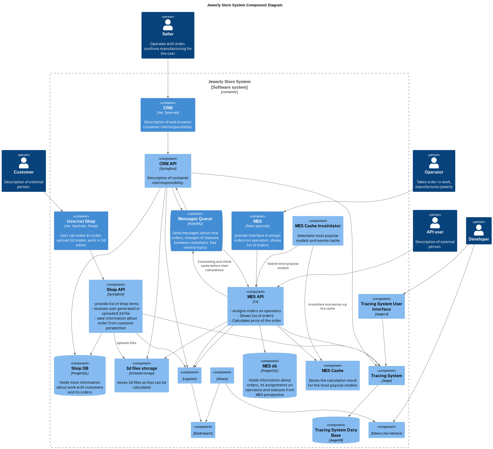

# Задание 5

## Разделы

- [Введение](#введение)
- [Что нужно сделать](#что-нужно-сделать)
- [Анализ системы в контексте кэширования](#анализ-системы-в-контексте-кэширования)
- [Зачем нужно кэширование](#зачем-нужно-кэширование)
- [Выбор подхода к кэшированию](#выбор-подхода-к-кэшированию)
- [Схема](#схема)
- [Стратегия инвалидации кэша](#стратегия-инвалидации-кэша)

## Введение

Итак, MES чувствует себя не очень хорошо. Операторы жалуются на низкую скорость работы со страницей, а новых клиентов не устраивает скорость выполнения заказа. Руководство «Александрита» просит вас разобраться с проблемой.

Вам нужно подготовить документ с описанием вашего архитектурного решения. Он поможет вам объяснить бизнесу и разработчикам, что нужно сделать, чтобы решить проблему.

В процессе разработки команда будет использовать артефакт как справочный документ. К таким документам удобно обращаться, если нужно понять, почему было принято то или иное решение.

## Что нужно сделать

1. Проанализируйте диаграмму системы и её описание. Решите, какую часть системы имеет смысл закешировать.
2. Добавьте в файл раздел «Мотивация». Опишите здесь, почему вы предлагаете внедрить кеширование, какие проблемы оно должно решить и какие элементы системы вы планируете включить в кеширование.
3. Добавьте раздел «Предлагаемое решение». Определите, какое кеширование вы будете внедрять — клиентское или серверное. Объясните, почему, на ваш взгляд, нужно использовать именно его. Если вы решите куда-то внедрить серверное кеширование, то поясните, какой паттерн будете применять — Cache-Aside, Write-Through или Refresh-Ahead. А также объясните, почему вы выбрали этот паттерн и почему остальные паттерны не подойдут или покажут себя хуже.
4. Нарисуйте диаграмму последовательности действий (Sequence diagram). Отобразите там, как проходит операция чтения списка заказов и запись об изменении статуса заказа. Там же опишите процесс кеширования с указанием всех сущностей, которые участвуют в кешировании. Добавьте диаграмму в раздел «Предлагаемое решение».
5. В блоке «Предлагаемое решение» опишите стратегию инвалидации кеша, которую вы планируете использовать. Объясните, какую стратегию инвалидации вы предлагаете (временную, по ключу, программную или другие), почему она подойдёт и почему не подойдут другие стратегии.
Не всегда очевидно, какое решение лучше. Чтобы выбрать оптимальный вариант, можете сделать сравнительный анализ в виде таблицы. Например, так:
6. Дополнительное задание. Если вы считаете, что может быть несколько решений и вам сложно выбрать между ними, можете описать несколько вариантов. В таком случае в разделе «Предлагаемое решение» запишите как минимум два решения и подготовьте сопоставление в виде таблицы.

## Анализ системы в контексте кэширования

Анализ текущей системы выявил, что MES-приложение является наиболее нагруженным компонентом. 
Операторы часто просматривают страницу заказов, что приводит к высокой нагрузке на базу данных и увеличению времени отклика приложения.

## Зачем нужно кэширование

Внедрение кэширования в текущий проект позволит:

- Увеличить скорость отображения страницы заказов для операторов.
- Снизить нагрузку на базу данных.
- Улучшить пользовательский опыт работы с приложением.
- Повысить общую производительность системы.

Данные изменения благотворительно скажутся на клиентском опыте, то не только понравиться нынешним пользователям, но и привлечёт новых.

Предлагается кэшировать следующие объекты в MES-приложении:

- Страницу заказов (список заказов).
- Отдельные заказы (детализированная информация о заказе).
- Результаты расчета стоимости заказа.

## Выбор подхода к кэшированию

Предлагается рассмотреть следующие варианты кэширования:

- `Серверное кэширование` - Кэширование данных на стороне сервера. Это более гибкое решение, которое дает больший контроль над данными. Можно централизованно решать, что и как кэшировать и когда инвалидировать кэш.

В данном случае, учитывая динамичность данных и необходимость централизованного управления, предпочтительным является серверное кэширование.

В MES-приложении преобладают операции чтения, поэтому для серверного кэширования можно рассмотреть следующие паттерны:

- `Cache-Aside` - При запросе данных приложение сначала проверяет наличие данных в кэше. Если данные найдены (cache hit), они возвращаются из кэша. Если данные не найдены (cache miss), приложение запрашивает данные из базы данных, сохраняет их в кэше и возвращает клиенту.
- `Write-Through` - При записи данных приложение сначала записывает данные в кэш, а затем в базу данных. Этот паттерн не подходит для MES-приложения, т.к. не факт, что только что созданный заказ будет сразу взят в работу.
- `Refresh-Ahead` - При запросе данных приложение проверяет срок действия данных в кэше. Если срок действия истекает, приложение асинхронно обновляет данные в кэше. Этот паттерн требует прогнозирования данных, которые будут запрошены, и не позволяет эффективно обновлять устаревшие заказы. Также, имеет более сложную реализацию.

Учитывая простоту реализации и гибкость управления кэшированием, наиболее подходящим паттерном является Cache-Aside.

## Схема

## Стратегия инвалидации кэша

Для обеспечения актуальности данных в кэше необходимо использовать стратегию инвалидации кэша. Предлагается использовать смешанную стратегию инвалидации:

- `Инвалидация по ключу` - При просмотре подробностей заказа или расчете стоимости заказа кэш инвалидируется по ключу (идентификатору заказа). Этот способ обеспечивает немедленное обновление данных при изменении статуса заказа.
- `TTL` - Для списка последних заказов используется инвалидация по времени (например, 10-60 секунд). Это позволяет обеспечить актуальность списка заказов, при этом минимизируя нагрузку на базу данных.

[<- На главную страницу](../ReadMe.md)
